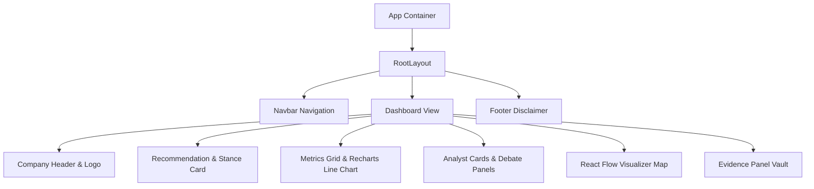

# CONSENSUS: Multi-Agent AI Investment Research Platform

CONSENSUS is a production-grade investment research committee simulation built using Next.js 15, TypeScript, LangGraph.js, and the Gemini 2.5 Flash LLM. Instead of relying on a single LLM prompt, CONSENSUS decomposes investment research into specialized AI agents that independently evaluate financial health, product moats, news sentiment, and industry growth, then hold a formal debate to produce evidence-linked consensus recommendations.

---

## Architecture Overview

```mermaid
graph TD
    User([User Search]) --> API_Resolve[GET /api/resolve/:query]
    API_Resolve --> Disambig[Disambiguation Dialog / Picker]
    Disambig --> API_Analyze[POST /api/analyze]
    
    subgraph AI Orchestration Layer (LangGraph)
        API_Analyze --> Planner[Planner Agent]
        Planner --> Resolver[Ticker Resolver]
        Resolver --> Coordinator[Research Coordinator]
        
        Coordinator --> Fin[Financial Analyst]
        Coordinator --> Bus[Business Analyst]
        Coordinator --> News[News Analyst]
        Coordinator --> Mkt[Market Analyst]
        
        Fin --> Collector[Evidence Collector]
        Bus --> Collector
        News --> Collector
        Mkt --> Collector
        
        Collector --> Bull[Bull Analyst]
        Collector --> Bear[Bear Analyst]
        Collector --> Risk[Risk Analyst]
        
        Bull --> Judge[Judge Agent CIO]
        Bear --> Judge
        Risk --> Judge
        
        Judge --> Consensus[Consensus Engine]
        Consensus --> Report[Report Generator]
    end
    
    Report --> Dashboard[React Flow Visualizer & Live Report Dashboard]
```

### Presentation & Components Tree



---

## Product Principles

1. **Explainability over Magic**: Every claim must be traceable to the retrieved evidence. Single opaque recommendations are rejected.
2. **Evidence Before Reasoning**: Agents are prohibited from using prior knowledge; they must declare "Insufficient evidence" if research is lacking.
3. **Small Specialized Agents**: Each agent owns exactly one responsibility, one system prompt, and one schema.
4. **Legal Compliance**: Non-advice warnings are persistently displayed on every recommendation dashboard.

---

## Installation & Setup

### 1. Prerequisites
- Node.js 18 or later
- npm or pnpm

### 2. Install Dependencies
```bash
npm install
```

### 3. Environment Variables
Create a `.env.local` file in the root directory:
```env
GEMINI_API_KEY=your_gemini_api_key
NEWS_API_KEY=your_news_api_key
TAVILY_API_KEY=your_tavily_api_key
NEXT_PUBLIC_APP_NAME=CONSENSUS

# Optional: Upstash Redis for distributed caching and rate limiting
UPSTASH_REDIS_REST_URL=your_upstash_redis_url
UPSTASH_REDIS_REST_TOKEN=your_upstash_redis_token

# Optional: LangSmith native tracing
LANGCHAIN_TRACING_V2=true
LANGCHAIN_API_KEY=your_langsmith_api_key
```

### 4. Run Development Server
```bash
npm run dev
```
Open [http://localhost:3000](http://localhost:3000) to view the application.

---

## AI Workflow Details

- **Planner**: Maps query structures to execution plans.
- **Ticker Resolver**: Excludes mutual funds, ETFs, and indices, resolving queries to verified stock symbols.
- **Research Coordinator**: Fetches financial details, stock charts, news, and search contexts in parallel.
- **Financial Analyst**: Computes margin growths, balance sheet quick ratios, and EPS health scores.
- **Business Analyst**: Scores product line configurations and economic moats (Wide, Narrow, None).
- **News Analyst**: Renders public and media sentiment scores (-100 to +100) and article impacts.
- **Market Analyst**: Outlines macroeconomic trends and competitor share mappings.
- **Evidence Collector**: Merges, deduplicates, and assigns unique, trackable IDs (`ev-1`, `ev-2`) to raw claims.
- **Bull / Bear / Risk Analysts**: Assemble argument matrices with strict, evidence-only access constraints.
- **Judge Agent**: CIO synthesis that weighs evidence credibility, flags contradictions, and determines BUY/HOLD/SELL verdicts.
- **Consensus Engine**: Applies weighted scoring: Financial (30%), Business (20%), News (15%), Market (10%), Bull (10%), Bear (10%), Risk (5%). Deducts points for contradictions and missing details.

---

## Legal and Non-Advice Disclaimer

> **IMPORTANT NOTICE:** Consensus is an educational/portfolio demonstration. Nothing here is financial advice. Do not make investment decisions based solely on this output. All company data is sourced from third-party APIs (Yahoo Finance, NewsAPI, Tavily) and is not guaranteed accurate, current, or complete.

---

## License
MIT License.
